# Internal

> Overview of the code base of baldrick-elm

This document has been generated automatically by
[baldrick-doc-ts](https://github.com/flarebyte/baldrick-doc-ts)

## Diagram of the dependencies

```mermaid
classDiagram
class `client.ts`{
  +runClient()
}
class `commanding-action.ts`{
  +cmdGenerateAction()
}
class `commanding-data.ts`
class `commanding-helper.ts`{
  - capitalize()
  - decapitalize()
  +toCamelCase()
  +toCommanderOption()
}
class `commanding.ts`
class `commit-message.ts`{
  +commitMessage()
}
class `compute-core-project.ts`{
  - capitalize()
  +computeCoreProject()
}
class `dev-tasks.ts`{
  +analyzeCmd()
  +testCmd()
  - mdCmd()
  - mdFixCmd()
  - whiskerNormCmd()
  +normCmd()
  +devCommands()
}
class `feature-helper.ts`{
  - isFeature()
  - toFeature()
  +toFeatures()
}
class `index.ts`
class `io-sfx.ts`{
  +toJsonString()
  - createWorkspace()
  - readReadme()
  - writeReadme()
  - readTechnicalDesign()
  - writeTechnicalDesign()
  - writeMaintenance()
  - writeLicense()
  - writeMakefile()
  - createSourceDir()
  - appendCommitMessage()
  - writeZshAlias()
  - writeCommandHelp()
  +updateAll()
}
class `makefile.ts`{
  - sortedByName()
  - toMakeCommand()
  - toMakePhonyHeader()
  - make()
  +makefile()
}
class `markdown-license.ts`{
  - copyrightRangeIfAny()
  - licenseBSD3()
  +licenseMd()
}
class `markdown-maintenance.ts`{
  - maintenanceOverview()
  +maintenanceMd()
  - removeNulls()
  +getMakefileCommands()
  +getZshAliases()
  +getCommandHelp()
}
class `markdown-readme.ts`{
  - capitalize()
  - libBadges()
  - keepSections()
  - docAndLinks()
  - installSection()
  +toReadmeMd()
}
class `markdown-technical-design.ts`{
  - keepSections()
  +toTechnicalDesignMd()
}
class `markdown.ts`{
  - getMainSection()
  - discardHeader2()
  - linesToSection()
  - detectSecondaryHeader()
  - getSecondarySections()
  - extractBadge()
  - countBadgeParts()
  - foldBadgePart()
  - locateBadgeZone()
  - isWithinBadgeZone()
  - findBadges()
  - keepHeaderBody()
  +parseMarkdown()
  - badgeToString()
  - sectionToString()
  +markdownToString()
  - installationTypeToText()
  - packageCmdToMd()
  - exampleToMd()
  - examplesToMd()
  +commandToMd()
}
class `model.ts`
class `term-formatter.ts`{
  - simplifyObj()
  - simplifyJson()
  - toJsonish()
  +basicFormatter()
  +errorFormatter()
}
class `utils.ts`{
  +stringBetween()
  +findHeader()
  +findQuote()
}
class `version.ts`
class `./index.js`{
  +commanding()
}
class `./io-sfx.js`{
  +updateAll()
}
class `./model.js`{
  +TermFormatterParams()
  +TermFormatterFormat()
  +ErrTermFormatterParams()
  +MdSection()
  +MdPackage()
  +MdDocument()
  +MdCommand()
  +InstallationType()
  +Badge()
  +CoreProject()
  +MakefileCommand()
  +RunnerContext()
  +GenerateActionOpts()
  +SupportedFeature()
  +GenerateRawOpts()
  +GenerateAction()
  +CmdOption()
  +CmdOptionsGenerator()
}
class `commander`{
  +Command()
  +Option()
}
class `./commanding-data.js`{
  +cmdOptionsGenerator()
}
class `./commanding-helper.js`{
  +toCommanderOption()
}
class `./feature-helper.js`{
  +toFeatures()
}
class `./term-formatter.js`{
  +errorFormatter()
  +basicFormatter()
}
class `./version.js`{
  +version()
}
class `node:path`{
  +path()
}
class `./commanding-action.js`{
  +cmdGenerateAction()
}
class `./commanding.js`{
  +Commanding()
}
class `fs-jetpack`{
  +jetpack()
}
class `./markdown-readme.js`{
  +toReadmeMd()
}
class `./markdown-maintenance.js`{
  +getMakefileCommands()
  +maintenanceMd()
  +getZshAliases()
  +getCommandHelp()
}
class `./markdown-license.js`{
  +licenseMd()
}
class `./markdown-technical-design.js`{
  +toTechnicalDesignMd()
}
class `./commit-message.js`{
  +commitMessage()
}
class `./compute-core-project.js`{
  +computeCoreProject()
}
class `./makefile.js`{
  +makefile()
}
class `fs-jetpack/types.js`{
  +FSJetpack()
}
class `markdown-table`{
  +markdownTable()
}
class `./dev-tasks.js`{
  +normCmd()
  +devCommands()
  +docCmd()
  +readyCmd()
  +buildCmd()
  +testCmd()
  +analyzeCmd()
}
class `./markdown.js`{
  +parseMarkdown()
  +markdownToString()
  +commandToMd()
}
class `./utils.js`{
  +stringBetween()
  +findQuote()
  +findHeader()
}
`client.ts`-->`./index.js`
`commanding-action.ts`-->`./io-sfx.js`
`commanding-action.ts`-->`./model.js`
`commanding-data.ts`-->`./model.js`
`commanding-helper.ts`-->`commander`
`commanding-helper.ts`-->`./model.js`
`commanding.ts`-->`commander`
`commanding.ts`-->`./commanding-data.js`
`commanding.ts`-->`./commanding-helper.js`
`commanding.ts`-->`./feature-helper.js`
`commanding.ts`-->`./model.js`
`commanding.ts`-->`./term-formatter.js`
`commanding.ts`-->`./version.js`
`commit-message.ts`-->`./version.js`
`compute-core-project.ts`-->`node:path`
`compute-core-project.ts`-->`./model.js`
`dev-tasks.ts`-->`./commanding-data.js`
`dev-tasks.ts`-->`./model.js`
`feature-helper.ts`-->`./model.js`
`index.ts`-->`./commanding-action.js`
`index.ts`-->`./commanding.js`
`io-sfx.ts`-->`fs-jetpack`
`io-sfx.ts`-->`./markdown-readme.js`
`io-sfx.ts`-->`./model.js`
`io-sfx.ts`-->`./markdown-maintenance.js`
`io-sfx.ts`-->`./markdown-license.js`
`io-sfx.ts`-->`./markdown-technical-design.js`
`io-sfx.ts`-->`./commit-message.js`
`io-sfx.ts`-->`./compute-core-project.js`
`io-sfx.ts`-->`./makefile.js`
`io-sfx.ts`-->`fs-jetpack/types.js`
`makefile.ts`-->`./markdown-maintenance.js`
`makefile.ts`-->`./model.js`
`markdown-license.ts`-->`./model.js`
`markdown-maintenance.ts`-->`markdown-table`
`markdown-maintenance.ts`-->`./dev-tasks.js`
`markdown-maintenance.ts`-->`./markdown.js`
`markdown-maintenance.ts`-->`./model.js`
`markdown-readme.ts`-->`./markdown.js`
`markdown-readme.ts`-->`./model.js`
`markdown-technical-design.ts`-->`./markdown.js`
`markdown-technical-design.ts`-->`./model.js`
`markdown.ts`-->`./model.js`
`markdown.ts`-->`./utils.js`
`term-formatter.ts`-->`./model.js`
```

